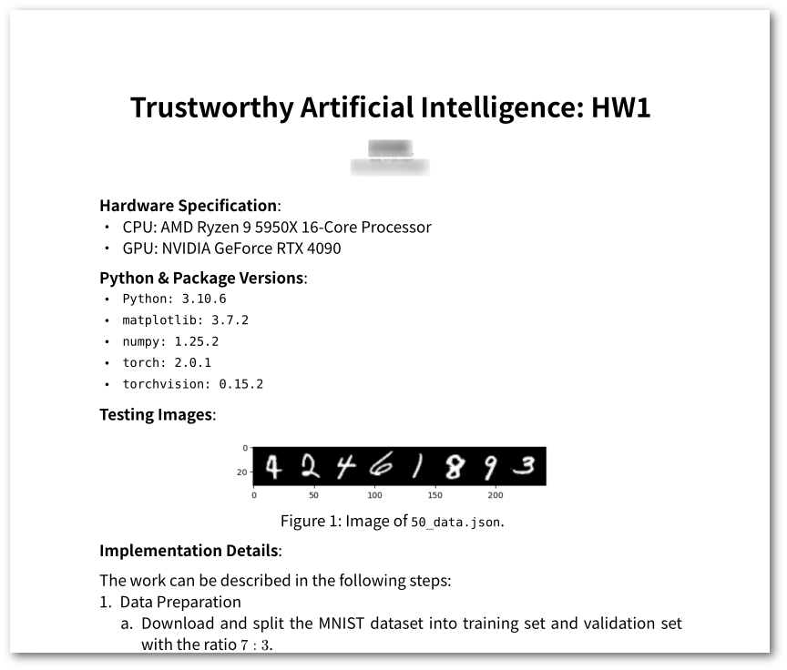
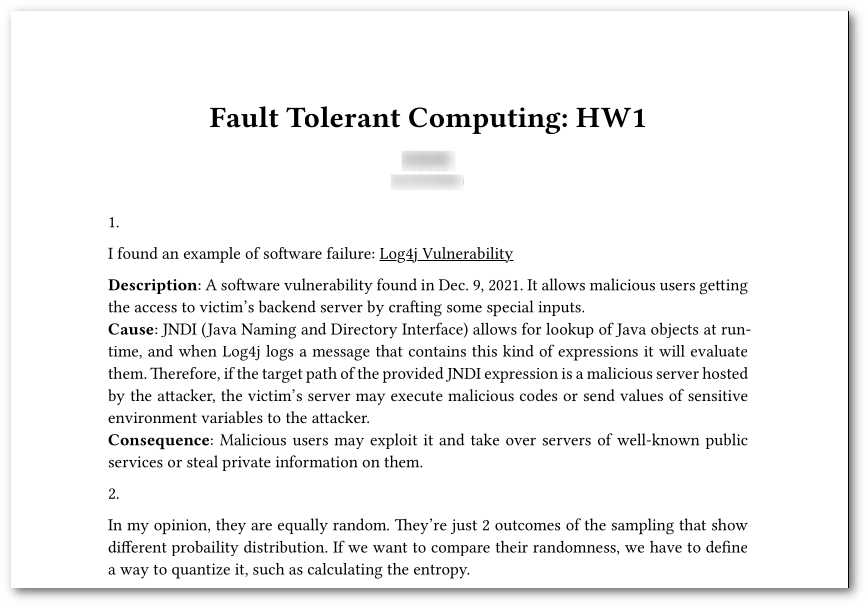

# typst-templates
This repo currently contains only 1 template.
Perhaps there'll be more in the future.

## Screenshots
- an example of `hw-report` template


- another example of `hw-report` template



## Installation
Clone this repo under the path `~/.local/share/typst/packages/`.
You can name it to the name you like.
As for me, I use `local`.

```sh
mkdir -p ~/.local/share/typst/packages
git clone https://github.com/Alan-Kuan/typst-templates.git ~/.local/share/typst/packages/<the name you like>
```

## Usage
First, import. Then, show.

The following is an example to use the `hw-report` template:
```typst
#import "@local/hw-report:1.0.0": *

#show: project.with(
  title: "A title",
  authors: (
    (name: "your name", id: "your student id"),
  ),
  font: ("Times New Roman")
)
```

## Parameters
### `hw-report`
| Parameter | Type | Description | Default |
| --- | --- | --- | --- |
| `lang` | `str` | passed as the `text()`'s `lang` parameter | `"en"` |
| `title` | `str` | title of the document | `""` |
| `authors` | `array` | authors of the document | `()` |
| `font` | `str` or `array` | passed as the `text()`'s `font` parameter | `"Noto Serif TC"` |

#### Format of `authors`'s elements:

Type: `dictionary`
| Key | Type | Description |
| --- | --- | --- |
| `name` | `str` | author's name |
| `id` | `str` | author's student ID |
